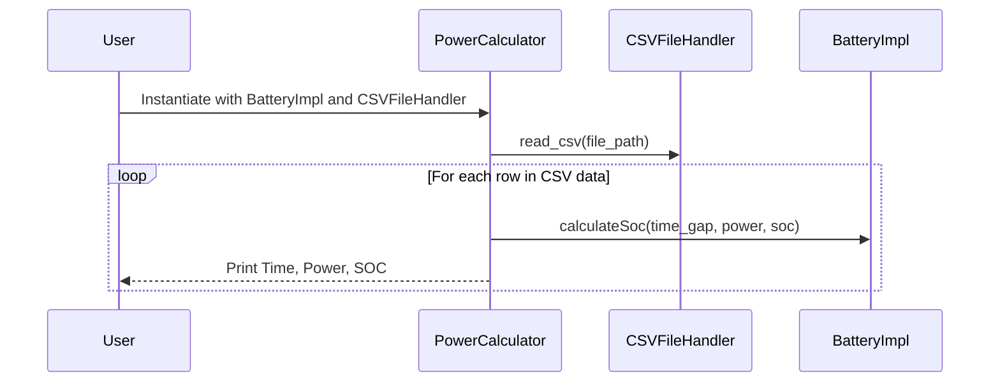

# README.md

## Project Overview

This project is a Python-based application that calculates the State of Charge (SOC) of a battery over time. The SOC is calculated based on the power consumed or generated at different time intervals. The power data is read from a CSV file.

## Project Structure

The project is structured into several classes:

- `CSVFileHandler`: This class is responsible for reading data from a CSV file and checking the validity of the file.
- `Battery`: This is an abstract base class that defines the interface for all batteries.
- `BatteryImpl`: This class is a concrete implementation of the `Battery` interface. It calculates the SOC of the battery.
- `PowerCalculator`: This class is responsible for calculating and printing the SOC at each time step.

## Sequence Diagram



## How to Run the Project

1. Ensure that Python is installed on your system.
2. Clone the repository to your local machine.
3. Navigate to the project directory.
4. Run the `battery_take_home.py` script with the CSV file as an argument. The CSV file should contain the power data at different time intervals.

```bash
python3 battery_take_home.py power_over_time.csv
```

## Output

The script will print the SOC at each time step in the following format:

```bash
Time,Power,SOC
```

## Dependencies

This project does not have any external dependencies. It uses only the Python Standard Library.

## Contributing

Contributions are welcome. Please submit a pull request with your changes.

## License

This project is licensed under the MIT License.